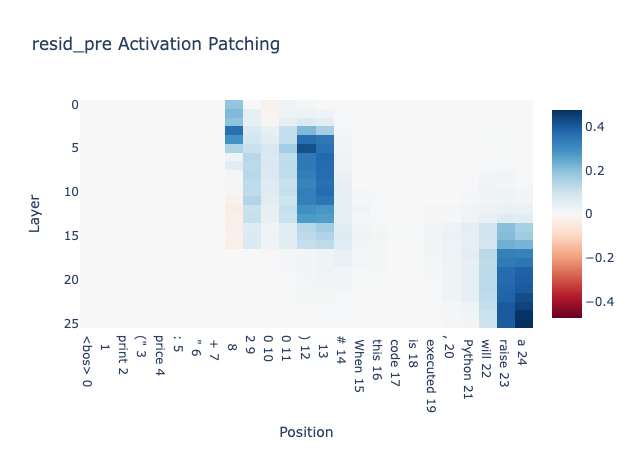

# Task - Error Type Prediction

Hey everyone, for the past week I have been working on sae circuit discovery for Error type prediction. I have progress in this repo mainly with regards to using gemma 2 2b it, with base model saes and doing node sae attribution patching.
The overall goal is to understand something general about how the model works with code, but I really care about going deep to get fundamental understanding of the mechanism with or without saes.
I first did residual stream patching. Found some layers where transitions were happening between token positions (my naive intuition was these layers have some sort of information passing). Only did attribution patching for those layer saes over relevant positions.

Disclaimers:
- I do not have circuit extraction set up, so cant report the faithfulness etc metrics yet
- The saes are base while the model is the instruct, so the error node is present basically everywhere, might migrate to gemma 2 9b base
- Currently only has 12 prompts, can distort things a bit, need to increase prompts
- This is direct effect from features to logits i.e. Relevant token pos -> res sae latent -> logits on the node level. I need to understand how the Sparse feature circuit paper did edge scores, the math is going over my head lol
- Only residual latents for now as well, I think attention and mlp residual will be more interesting

Would love everyone's opinion on these results if they are interested

## Clean example 

Prompt: """print("temperature: " + 130)
\# When this code is executed, Python will raise a"""

Expected answer: TypeError

## Corrupted example 

Prompt: """print("temperature: " + "130"
\# When this code is executed, Python will raise a"""

Expected answer: SyntaxError

## Patching metric 

Logit difference - (TypeError Token Logit - Syntax Logit)

## Logit difference results 

Instruct model:
Clean: 2.899, Corrupted: -2.275

Running with base model saes without error term:
Clean: 4.209, Corrupted: 4.499

With error term:
Clean: 2.899, Corrupted: -2.275

There is a big gap between with and without error, and this is a big threat to validity. But hopefully I can still learn something from the progress. I hope to shift to 9b base soon. I chose 2 2b instruct because base model can't do this task. 

# Circuit (Hypothetical and naive) no extraction, no faithfulness yet

I found three types of latents as shown above.

## Supporting evidence 

Non SAE residual stream patching shows transitions between tokens: 

The saes were selected based on layers near transitions. 

I think indexed at specific positions to find direct effect of latents from the relevant positions:

You can find the top 25 latents for direct effect with their auto interp descriptions here: [top 25 latents with description](/tasks/error_type/top_25_latents_direct_from_relevant_pos.json)

I also check the tokens at which the relevant latents fire:

### Latent Activation at token before number 

### Latent Activation at token after number 

### Latent Activationa at token at END

